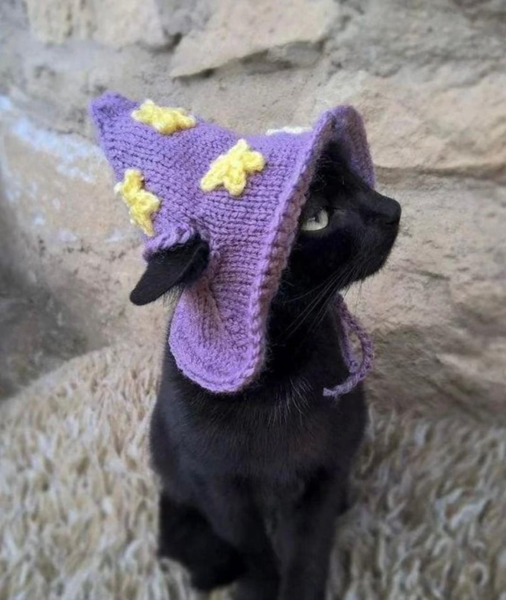

## Introduction

 

Hi there.

I'm Ziyan Zhuang, in the Master's Programme of Linguistic Diversity and Digital Humanities at the University of Helsinki. I am currently on the digital humanities track.

I would like to know more about how to use technical methods in the field of humanities.This is <em>why</em> I am here:)

I'm also interested in astrology and other Occult stuff.

Nice to meet you! / Hauska Tutustua!

## Find me on

[LinkedIn](https://www.linkedin.com/in/ziyan-zhuang-48b426331), [GitHub](https://evelinezzy.github.io)

## Contact

My email address is of the form ziyan.zhuang@helsinki.fi. 

## Courses I've Taken

[Suomi 1A](https://studies.helsinki.fi/courses/course-implementation/hy-opt-cur-2425-025bf394-a522-403d-891c-54667d1ade07), fall 2024

[Introduction to Linguistic Diversity and Digital Humanities](https://studies.helsinki.fi/courses/course-implementation/hy-opt-cur-2425-9df97501-21e6-4b8d-9de4-e91303f2ff71/LDA-301), fall 2024

[Command-Line Tools for Linguists](https://studies.helsinki.fi/courses/course-implementation/hy-opt-cur-2425-261401a1-c550-4436-91b9-7edf4a1a3b57/KIK-LG221), fall 2024

[Elements of Digital Humanities](https://studies.helsinki.fi/courses/course-implementation/hy-opt-cur-2425-8c84ad80-7fa3-415e-b7d1-f0d1fc2bb236/LDA-H304),fall 2024

[Programming for Digital Humanities](https://studies.helsinki.fi/courses/course-implementation/hy-opt-cur-2425-d85cca5c-0a41-4332-9f2b-5f8d82d602c9/LDA-H511),fall 2024

## Projects

[cmdline-course Github project](https://evelinezzy.github.io),fall 2024

## Misc. 

[Astrology account on Red](https://www.xiaohongshu.com/user/profile/650410510000000012006a61?xhsshare=CopyLink&appuid=5b1ff51b4eacab52d2635920&apptime=1730218685&share_id=774d9db8a5584cecba6ccd16feba4c6b) 
